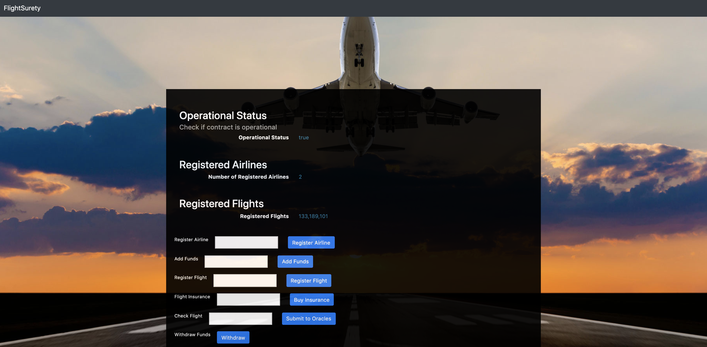
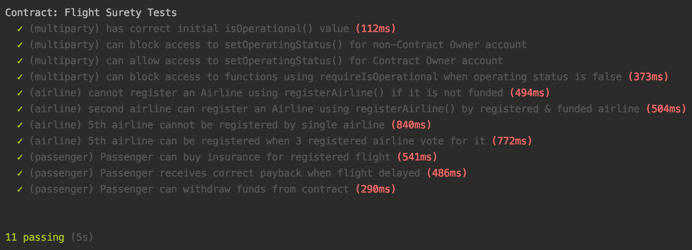

# FlightSurety

FlightSurety is a sample application project to showcase a decentralised method for passengers to insure flights and receive payback once is a flight is delayed.
Smart contracts are used to handle the logic and interact with Oracle contracts (simulated here) to establish the ground truth.

## Install

This repository contains:
 * Smart Contract code in Solidity (using Truffle), 
 * Tests (also using Truffle), 
 * A simple dApp (using HTML, CSS and JS) and 
 * A server app that simulates oracle contracts.

To install, download or clone the repo, then:

`npm install`
`truffle compile`

## Develop Client

To use the dapp:

`truffle migrate`
`npm run dapp`

To view dapp:

`http://localhost:8000`

 

To run truffle tests:

`truffle test ./test/flightSurety.js`
`truffle test ./test/oracles.js`

 

## Develop Server

`npm run server`
`truffle test ./test/oracles.js`

## Deploy

To build dapp for prod:
`npm run dapp:prod`

Deploy the contents of the ./dapp folder

